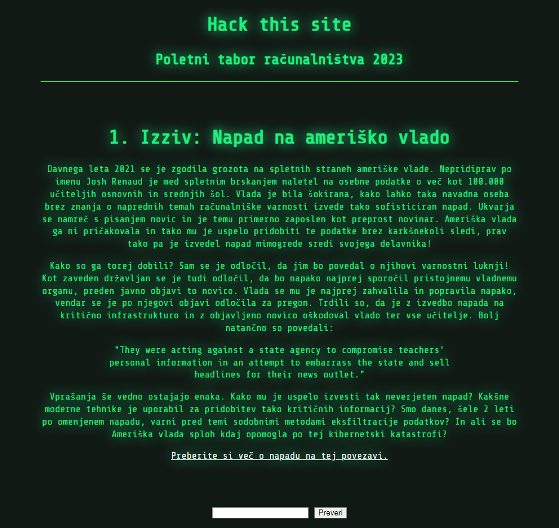
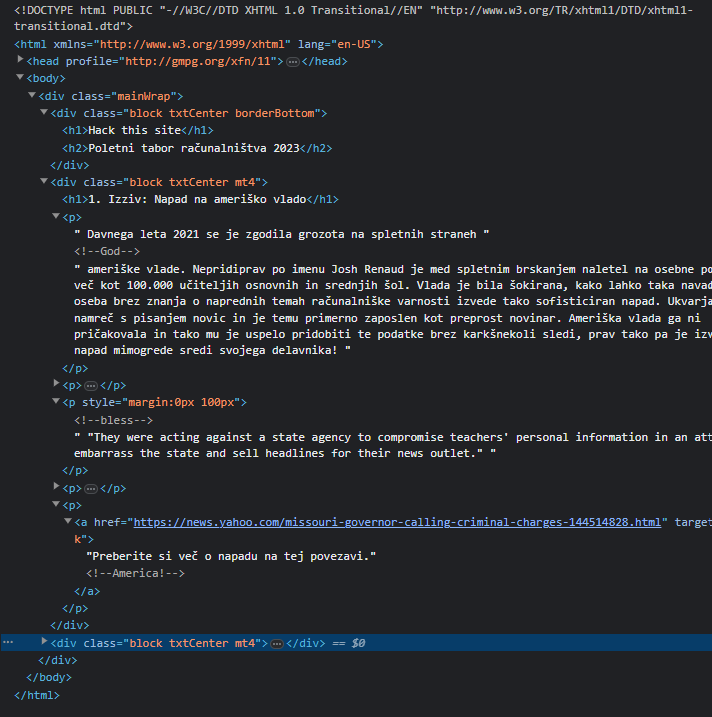

|[<<](/guides/chall0.md)|[START](/guides/main.md)|[0](/guides/chall0.md)|[1](/guides/chall1.md)|[2](/guides/chall2.md)|[3](/guides/chall3.md)|[4](/guides/chall4.md)|[5](/guides/chall5.md)|[6](/guides/chall6.md)|[7](/guides/chall7.md)|[8](/guides/chall8.md)|[9](/guides/chall9.md)|[10](/guides/chall10.md)|[END](/guides/end.md)|[>>](/guides/chall2.md)|
|:-|:-|:-|:-|:-|:-|:-|:-|:-|:-|:-|:-|:-|:-|:-|

#### Piškotek / Cookie = 6ZXspCLaxGdYNO6Tlum4Te9xFOhv6U7T49ztrO3yuqqL9redzDemESEw6i78hRTm

# Problem 1 / Challenge 1
Napad na ameriško vlado

[Preberi si več o napadau na tej povezavi](https://consent.yahoo.com/v2/collectConsent?sessionId=3_cc-session_2a0d14e6-221d-44bd-bda8-f834c663f723)

# Namigi / Hints

    <i>Namig 1</i> 

    Preberi članek

    <i>Namig 2</i> 

    Kaj je vidno v kodi in ne na spletni strani?

    <i>Namig 3</i> 

   CTRL + U in pogledamo vir strani in <b>namig 2</b>

# Rešitev / Solution

<b>
    Rešitev
</b>

    <b>God bless America!</b>

<b>
    Opis
</b>

Slika vira strani v F12

